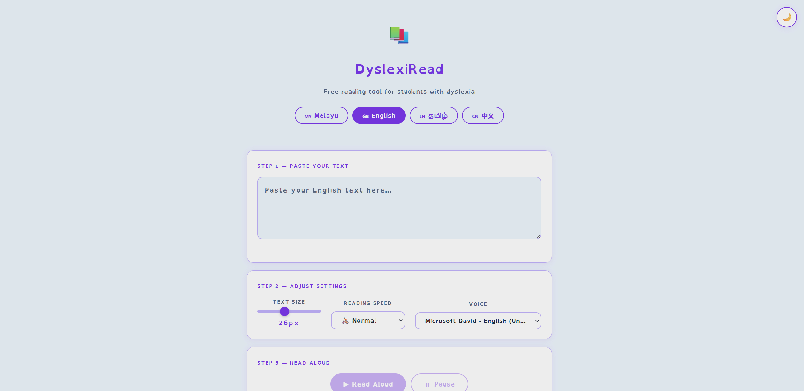

# 📚 DyslexiRead

**Free, browser-based reading tool for students with dyslexia.**

Built for Malaysia's multilingual classrooms, featuring Malay, English, Tamil, and Chinese. It's all on-device with no account required.


---

## What It Does

DyslexiRead reads your text aloud, word-chunk by word-chunk, with each group highlighted in sync so your eyes always know exactly where to follow. 
It uses the **OpenDyslexic** font, adjustable text sizes, and your device's built-in voices. Hence there are no plugins and no data leaving the device.



---

## Features

| Feature | Detail |
|---|---|
| **Chunk-by-chunk reading** | Text split into 5-word groups; each group highlights as it's read |
| **OpenDyslexic font** | Proven to improve readability for dyslexic readers |
| **4 languages** | Malay, English, Tamil, Chinese with full UI translation |
| **Voice selection** | Lists all system voices for the chosen language; remembers your pick |
| **Adjustable speed** | 0.6× (Very Slow) to 1.5× (Very Fast) |
| **Font size slider** | 16px to 40px, saved to localStorage |
| **Day / Night mode** | High-contrast dark theme for low-light reading |
| **Progress bar** | Visual reading progress with ARIA support |
| **Keyboard shortcuts** | Space to play/pause; arrow keys to step through chunks |
| **100% private** | Everything runs in the browser; nothing is ever sent to a server |

---

## Language Support

| Language | Windows | Android | iPhone/iPad | Mac |
|---|---|---|---|---|
| 🇬🇧 English | ✅ Excellent | ✅ Excellent | ✅ Excellent | ✅ Excellent |
| 🇲🇾 Bahasa Melayu | ✅ Good (install voice) | ✅ Good | ⚠️ Limited | ⚠️ Limited |
| 🇨🇳 中文 (Chinese) | ✅ Good (install voice) | ✅ Good | ✅ Good | ✅ Good |
| 🇮🇳 தமிழ் (Tamil) | ⚠️ Limited (install voice) | ✅ Good | ✅ Good | ⚠️ Limited |

> Tamil text is displayed in **Noto Sans Tamil** (OpenDyslexic does not cover the Tamil script). All other languages use OpenDyslexic.

---

## Getting Started

DyslexiRead is a single HTML file.

### Option 1: Open locally
```bash
git clone https://github.com/CoolerGit/dyslexiread.git
cd dyslexiread
# Open index.html in your browser
```

### Option 2: Deploy to GitHub Pages
1. Fork this repository
2. Go to **Settings → Pages**
3. Set source to the `main` branch, root folder
4. Your app will be live at `https://your-username.github.io/dyslexiread/`

### Option 3: Just download the file
Download `index.html` and open it it any browser, preferably Microsoft Edge.

---

## Recommended Browsers

| Device | Browser | Why |
|---|---|---|
| Windows | **Microsoft Edge** | Uses Windows neural voices — noticeably more natural than Chrome |
| Android | **Chrome** | Best Google TTS integration; widest language support |
| iPhone/iPad | **Safari** | Only Safari has full Web Speech API support on iOS |
| Mac | **Safari** | Access to Apple's high-quality built-in voices |

---

## Keyboard Shortcuts

| Key | Action |
|---|---|
| `Space` | Play / Resume from pause |
| `←` | Step back one chunk |
| `→` | Step forward one chunk |

---

## Privacy

DyslexiRead processes everything on your device.

- Your text is **never sent to any server**
- No account required
- No analytics, no ads, no tracking
- All preferences (font size, speed, voice, language) are stored locally in your browser and never leave your device

---

## How It Works

```
User pastes text
      ↓
Text split into 5-word chunks
      ↓
Chunks displayed in reading area
      ↓
Web Speech API reads each chunk aloud
      ↓
Active chunk highlighted in sync
      ↓
Progress bar updates, loop continues
```

The chrome backgrounding bug (where the browser silently kills the speech queue after ~15 seconds) is handled with a keepalive interval that detects the gap and resumes seamlessly.

---

## Tech Stack

| Layer | Technology |
|---|---|
| Markup | HTML5 |
| Styling | CSS custom properties (no framework) |
| Logic | Vanilla JavaScript (no framework) |
| Speech | Web Speech API (browser-native) |
| Fonts | OpenDyslexic (CDN), Noto Sans Tamil (Google Fonts) |
| Offline | Service Worker + Web App Manifest |

---

## Contributing

Pull requests are welcome.

1. Fork the repository
2. Make your changes in `index.html`
3. Test across Chrome, Edge, and Safari
4. Open a pull request with a clear description

---

## Licence

MIT. Free to use, modify, and redistribute. Attribution appreciated but not required.

---

<p align="center">Built for Malaysian students · Free forever · No data collected</p>
